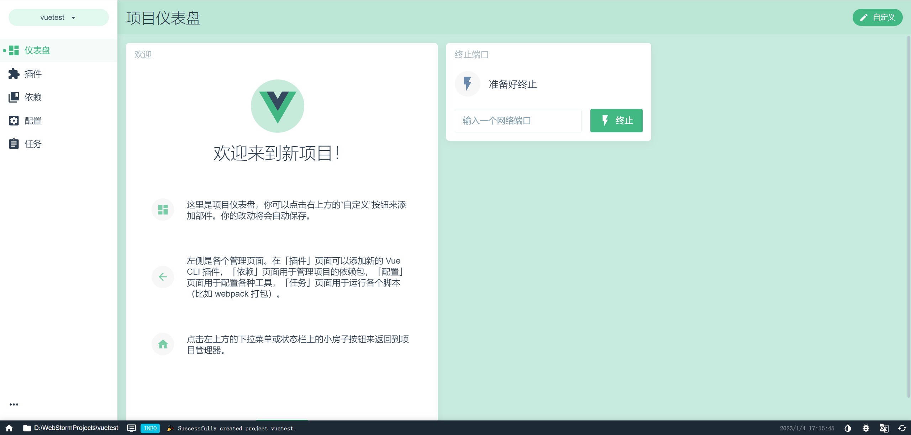
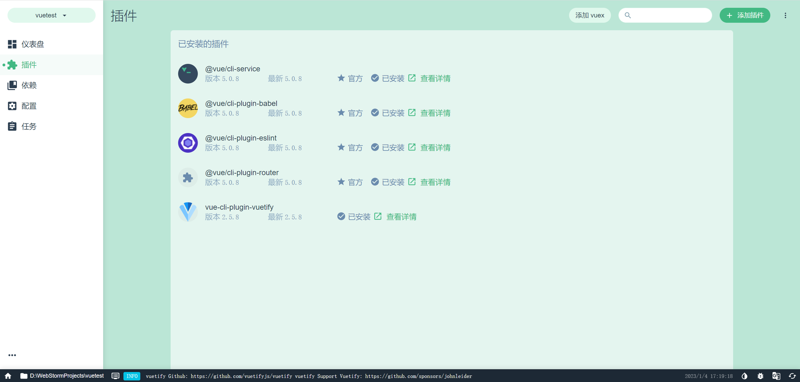
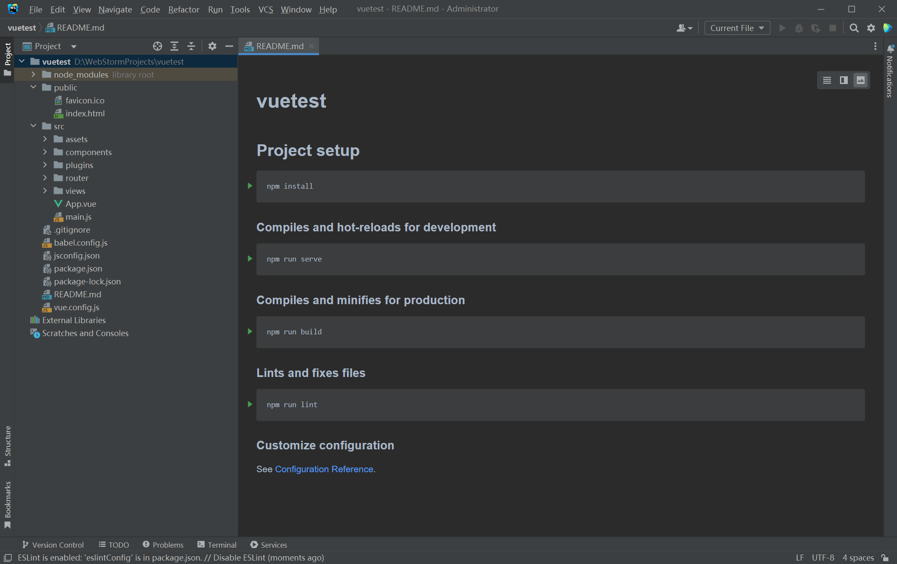
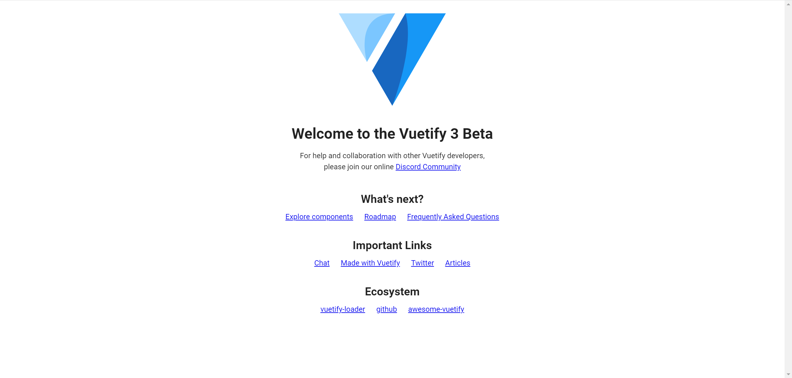

# 使用 Webstorm 开发 Vuejs 项目相关备忘录

## 1 安装 Webstorm

1. 下载应用程式并安装：[WebStorm Offical](https://www.jetbrains.com/webstorm/) 并激活。

## 2 安装 Node.js

1. 下载安装文件并安装：[Node.js Offical](http://nodejs.cn/download/)  。

2. 在控制台检查 `node` `npm` 安装结果：

   ```shell
   node -v
   npm -v
   ```

3. 最好把 `cnpm` 也安装：

   ```shell
   npm install cnpm -g
   ```

4. 按需安装 TypeScript 支持：

   ```shell
   npm install typescript -g
   ```

## 3 安装 Vue 及相关组件

1. 控制台：

   ```shell
   cnpm install vue
   cnpm install --global vue-cli
   ```

2. 检查：

   ```shell
   vue -V
   ```

   这里需要注意安装的 `vue` 版本是否高于 `3.0` 因为很多功能需要版本高于 `3.0` 才支持，但有时默认安装的是 `2.9.6` ，这时需要卸载重装：

   ```shell
   npm uninstall vue/cli -g
   npm i -g --force @vue/cli
   vue -V
   ```

3. 启动图形界面

   ```shell
   vue ui
   ```

   

## 4 创建并配置项目

1. 根据指引在对应路径下初始化项目。

   

2. 安装 `vuetify` `vue-route` 插件

   

## 5 WebStorm 编程

1. 在 `WebStorm` 中找到项目路径并打开项目

   

2. 配置 Terminal 设置，在 `File-Settings-Tools-Terminal` 中选取对应终端，因为 Powershell 和 CMD 不一样。设置好后尝试在控制台运行本项目：

   ```shell
   npm run serve
   ```

   将会自动弹出页面，完成：

   