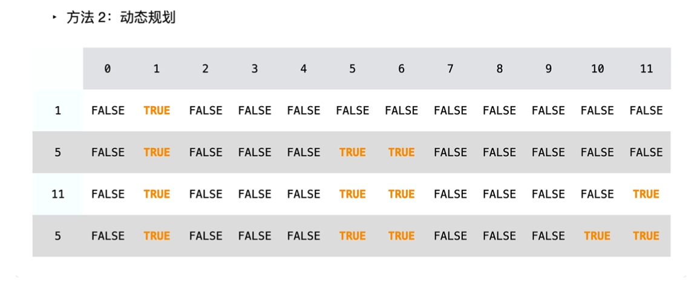

# 416. 分割等和子集

给你一个 **只包含正整数** 的 **非空** 数组 `nums` 。请你判断是否可以将这个数组分割成两个子集，使得两个子集的元素和相等。

**示例 1：**

```
输入：nums = [1,5,11,5]
输出：true
解释：数组可以分割成 [1, 5, 5] 和 [11] 。
```

**示例 2：**

```
输入：nums = [1,2,3,5]
输出：false
解释：数组不能分割成两个元素和相等的子集。
```

 **提示：**

- `1 <= nums.length <= 200`
- `1 <= nums[i] <= 100`

## Python

```python
class Solution(object):
    def canPartition(self, nums):
        """
        :type nums: List[int]
        :rtype: bool
        """
        import numpy as np
        if sum(nums) % 2 == 1:
            return False
        target = sum(nums) // 2 + 1
        n_num = len(nums)
        dp = np.zeros(target*n_num).reshape(n_num, target)
        if nums[0] <= target:
            dp[0][nums[0]] = 1
        for i in range(1, n_num):
            dp[i] = dp[i-1]
            for j in range(target):
                if j == nums[i]:
                    dp[i][j] = 1
                if nums[i] < j:
                    dp[i][j] = dp[i-1][j - nums[i]] + dp[i-1][j]
        res = True if dp[-1][target-1] > 0 else False
        return res
```



- 此问题等价于：在这个序列里找到一些数让它等于总和的一半。
- 新建一个 `[len(nums), sum(nums) // 2 + 1]` 的 `dp` 数组，后面 `+1` 是我们想第 `j` 列就代表 `j` 这个数能不能在这个序列中凑出来，因此需要加一位。
- 手动初始化第一行，让 `dp[nums[i]] = True` ，前提是 `nums[i] < target` 。
- 后面每一行，先复制上一行，然后对 `j>nums[i]` 的位置判断：
  - `if nums[i] == j` 则这个位置是可行的，设置为 `True` 。
  - `if dp[i-1][j] == True` 说明这个位置在上一行已经可行，复制下来为 `True` 。
  - `if dp[i-1][j-nums[i]] == True` 说明这个位置可以由 `nums[i]` 加上一个数可行，设置为 `True` 。
- 直到最后 `dp[-1][-1]` 的位置就是查询完整个序列后能不能实现一种组合为序列和一半的情况。

## C++

```c++
class Solution {
public:
    bool canPartition(vector<int>& nums) {
        // n 个数
        int n_num = nums.size();
        // 求序列和及 target 
        int nums_sum = 0;
        for (int n: nums){
            nums_sum += n;
        }
        int target = nums_sum / 2 + 1;
        // 特殊：若序列和为奇数则返回 false
        if (nums_sum % 2 == 1){
            return false;
        }
		// 初始化一个 [n_num, target] 的全0二维数组
        vector<vector<int>> dp(n_num, vector<int>(target+1, 0));
        // 手动初始化第一行
        if (nums[0] <= target){
            dp[0][nums[0]] = 1;
        }
        // 对后面每一个数遍历
        for (int i=1; i<n_num; i++){
            //先复制上一行
            for (int j=0; j<target; j++){
                dp[i][j] = dp[i-1][j];
            }
            // 每个位判断，如果 nums[i] == j 则这个位直接可行，对于 j > nums[i]
            // 时考虑此位是否由前面相加得到或由上一行得到
            for (int j=0; j<target; j++){
                if (j==nums[i]) {
                    dp[i][j] = 1;
                }
                if (nums[i] < j){
                    dp[i][j] = dp[i-1][j] || dp[i-1][j-nums[i]];
                }
            }
        }
        // 最后一行最后一列代表遍历完序列后能不能找到一种组合为序列和一般
        return dp[n_num-1][target-1] > 0? true: false;
    }
};
```

- 注意非常常用的二维数组初始化写法：

  ```c++
  vector<vector<int>> = dp(rows, vector<int>(cols, 0));
  // 等价于
  vector<vector<int>> dp = vector<vector<int>>(n_num, vector<int>(target + 1, 0));
  ```

- `true / false` 等价于 `1 / 0` 因此用条件判别式 `||` `&&` 这些更快。

- 对 `vector` 求和可以用：

  ```c++
  #include <numeric>
  int sum = accumulate(nums.begin(), nums.end(), 0);
  ```

