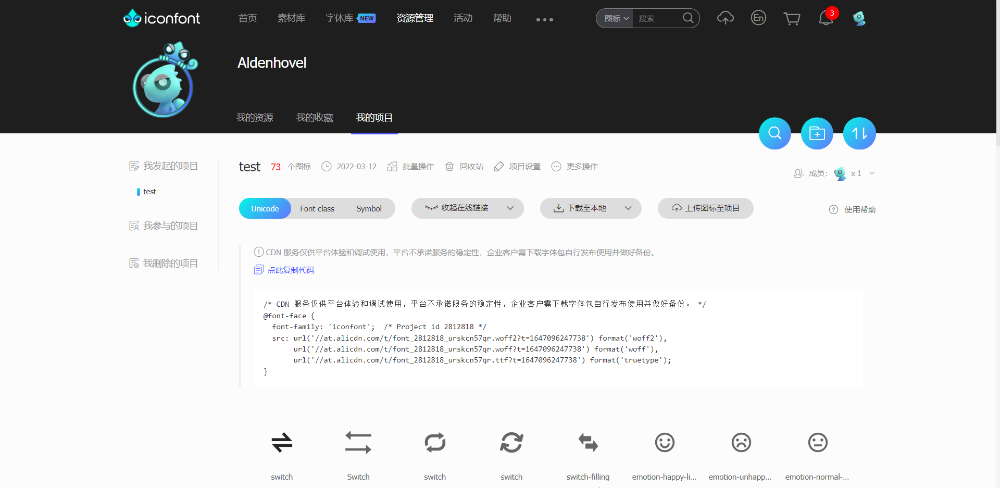
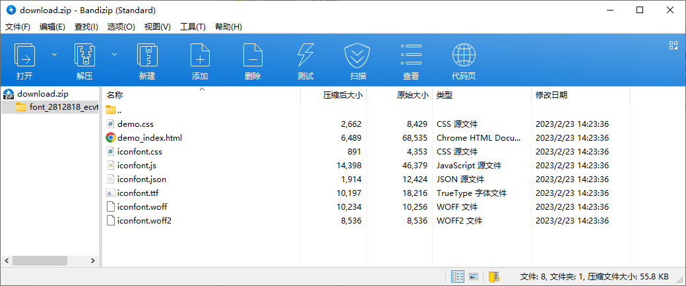
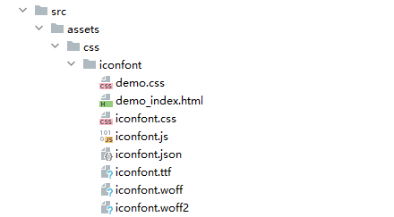
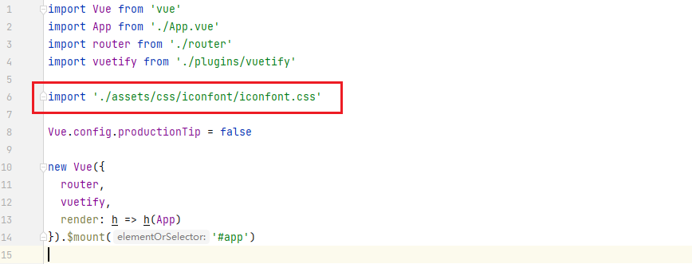
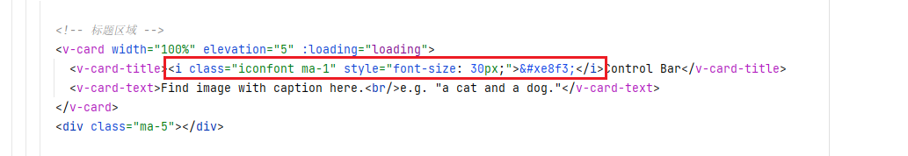

# Vue 使用 iconfont 流程

1. 在 [iconfont.cn](www.iconfont.cn) 中选择好项目和包含的图标。

   

2. 点击 `下载至本地` 得到 `zip` 文件，解压缩，得到一系列 `css` `ttf` `wottf` 等文件。

    

3. 将这些文件复制到 Vue 项目下的 `assets/css/iconfont/` 目录下。

   

4. 在 `main.js` 中引入 `assets/css/iconfont/iconfont.css` 文件。

   

5. 在 Vue 组件中即可使用 `iconfont` 类，中间是对应的 Unicode 代码，可以在 iconfont.cn 中查询复制下来。

   

